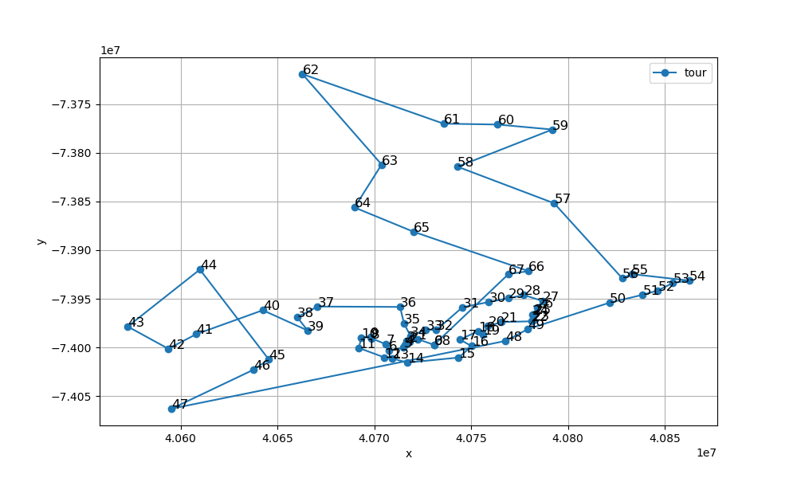

# CSE6140 Fall 2025 - Group 6 Project

This repository contains the implementation and analysis code for the CSE6140 course project at Georgia Tech. The project focuses on brute force, approximation, local search (simulated annealing) algorithms for solving the **Traveling Salesman Problem (TSP)**.

## Group Members

- Member 1: Feier Wu, (github username: [username])
- Member 2: Tomoki Koike, (github username: smallpondtom)

## Project Structure

- `code/`: Directory containing all the implementation and analysis scripts.
  - `code/exec.py`: Main execution script to run different TSP algorithms.
  - `code/analysis.py`: Script for analyzing the performance of the implemented algorithms.
  - `code/brute_force.py`: Implementation of the brute force algorithm for TSP.
  - `code/approx.py`: Implementation of the approximation algorithm for TSP.
  - `code/local_search.py`: Implementation of the local search (simulated annealing) algorithm for TSP.
- `data/`: Directory containing TSP dataset files.
- `result/`: Directory to store the analysis CSV file.
- `output/`: Directory to store output from algorithm executions (such as tours and distances) in `.sol` file format.
- `plot/`: Directory for storing plots of tours.
